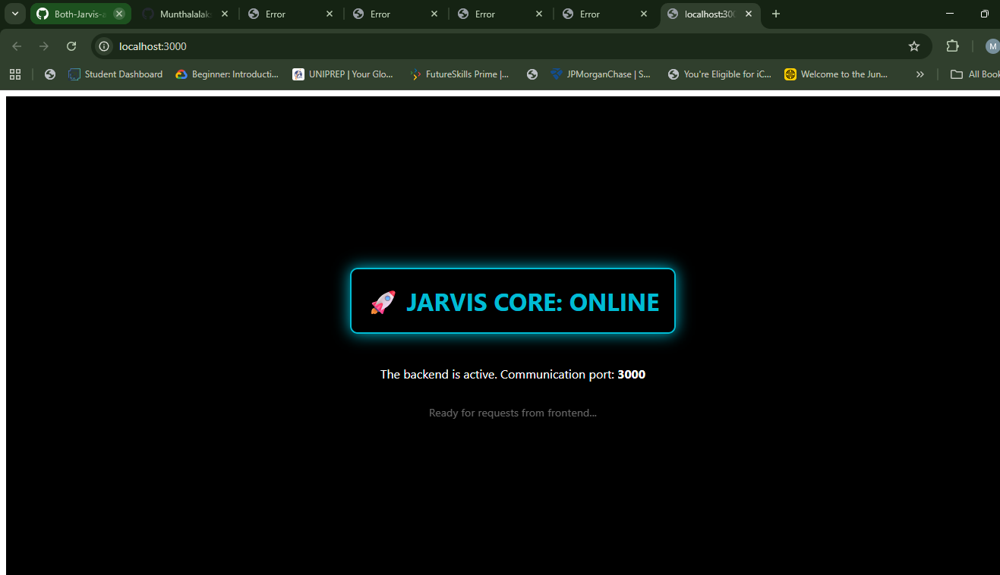

# 🚀 AI Chat Mode: Jarvis System

This project is a Siri-inspired AI assistant named **Jarvis**. It uses a Node.js backend to process user messages and a frontend interface for voice recognition and speech synthesis.



## 📋 System Overview

The system consists of two main parts: the **Frontend** (Browser-based Voice UI) and the **Backend** (Node.js Express Server).

### Technical Specifications
| Component | Technology | Description |
| :--- | :--- | :--- |
| **Frontend** | HTML5, JavaScript (ES6) | Handles Web Speech API for voice-to-text. |
| **Backend** | Node.js, Express.js | Processes logic and manages chat history. |
| **Middleware** | CORS | Allows secure communication between UI and Server. |
| **Data Format** | JSON | Standard format for sending/receiving messages. |
| **Port** | 3000 | Default local server communication port. |

---

## 🛠️ Setup Instructions

### 1. Prerequisites
Ensure you have [Node.js](https://nodejs.org/) installed on your machine.

### 2. Installation
Open your terminal in the project folder and run:
```bash
npm init -y
npm install express cors
